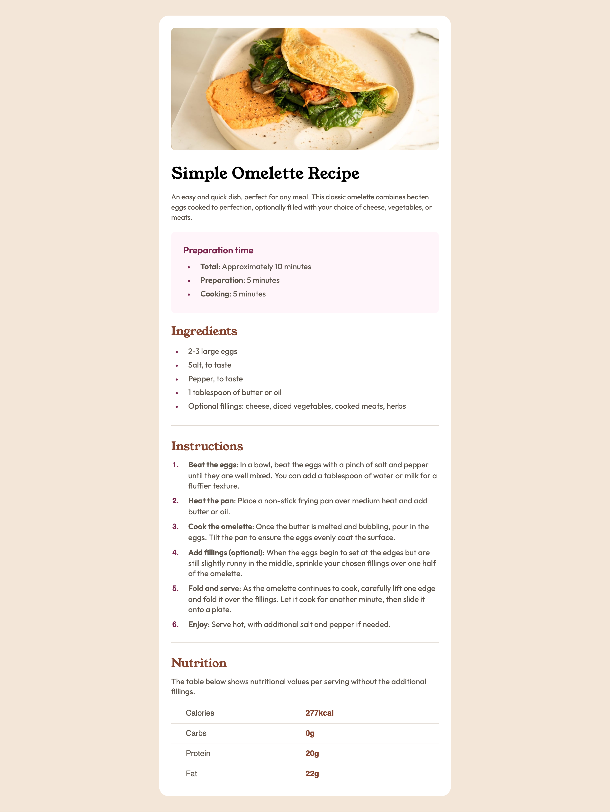

# Frontend Mentor - Recipe page solution

This is a solution to the [Recipe page challenge on Frontend Mentor](https://www.frontendmentor.io/challenges/recipe-page-KiTsR8QQKm). Frontend Mentor challenges help you improve your coding skills by building realistic projects. 

## Table of contents

- [Overview](#overview)
  - [Screenshot](#screenshot)
  - [Links](#links)
- [My process](#my-process)
  - [Built with](#built-with)
  - [What I learned](#what-i-learned)
  - [Continued development](#continued-development)
- [Author](#author)

## Overview

### Screenshot

### Links

- Solution URL: [Add solution URL here](https://your-solution-url.com)
- Live Site URL: [Add live site URL here](https://your-live-site-url.com)

## My process

### Built with

- Semantic HTML5 markup
- CSS custom properties
- Flexbox

### What I learned

I learned more about how to use 'max-width' vs width, and why using 'height' is not always a great option, and to rather let content and padding define height of a box. I also have improved drastically at my implementation of flexbox. My semantic HTML is really coming together as well, used the article and section tags to the best of my ability. This was also my first time implementing the 
 tag for visual line breaks

### Continued development

I'll continue to learn more about which CSS properties are best, and when to let content define the size of a box.

## Author

- Frontend Mentor - [@tea-leaves00](https://www.frontendmentor.io/profile/tea-leaves00)

